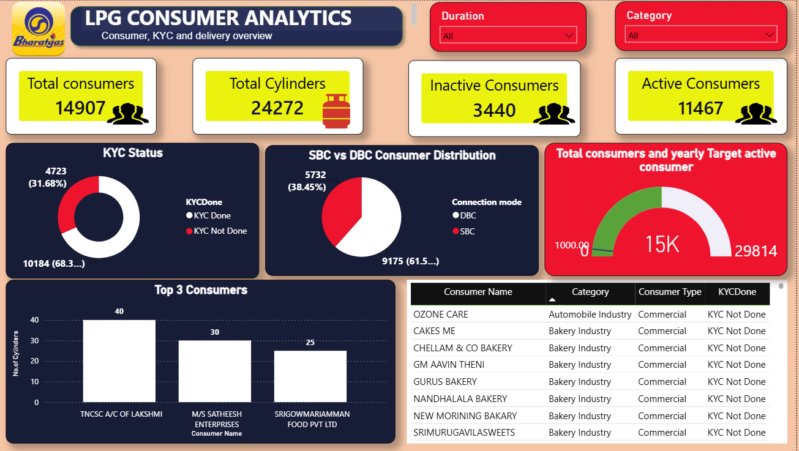

# Bharat Gas Consumer Analytics Dashboard

## Dashboard Preview

---

## Project Overview

This project focuses on transforming unstructured Bharat Gas distributor consumer data into a clean, analysis-ready dataset using Power Query and Power BI. The raw data contained duplicate records, inconsistent text values, unwanted columns, extra header rows, and formatting issues that required extensive data preparation before reporting.

---

## Business Problem

The distributor data was not suitable for direct analysis due to poor data quality. Decision-makers could not accurately track consumer activity, KYC status, cylinder usage, and refill patterns without first cleaning and standardizing the dataset.

---

## Data Cleaning & Transformation Process

### Header Standardization
- Promoted first row as column headers
- Removed unnecessary top rows from source files

### Data Type Correction
- Converted text, date, and numeric columns into appropriate formats
- Fixed mixed datatype issues

### Duplicate Removal
- Identified and removed duplicate consumer records
- Ensured unique consumer information for accurate reporting

### Text Cleaning
- Removed hidden characters and special symbols
- Trimmed leading and trailing spaces
- Standardized consumer-related text fields

### Column Optimization
- Removed irrelevant and unused columns
- Improved dataset performance and readability

### Data Structuring
- Split combined columns into meaningful attributes
- Renamed columns with business-friendly names

### Data Validation
- Sorted and verified records
- Checked for missing and inconsistent values

---

## Power Query Steps Applied

- Promoted Headers
- Changed Column Type
- Removed Duplicates
- Cleaned Text
- Trimmed Text
- Sorted Rows
- Removed Columns
- Removed Top Rows
- Split Column by Position
- Renamed Columns

---

## Key Insights Generated

- Total Consumers
- Active Consumers
- Inactive Consumers
- SBC Consumers
- DBC Consumers
- KYC Completed Consumers
- KYC Pending Consumers
- Aadhaar Linked Consumers
- Refill Activity Analysis
- Consumer Distribution Analysis

---

## Tools & Technologies

- Power BI
- Power Query
- DAX
- Microsoft Excel

---

## Skills Demonstrated

- Data Cleaning
- Data Transformation
- Data Validation
- Power Query
- DAX
- Dashboard Development
- Data Visualization
- Business Intelligence Reporting

---

## Project Highlights

- Transformed unstructured distributor data into an analysis-ready dataset
- Improved data quality through extensive cleaning and validation
- Developed KPI-driven dashboards for consumer monitoring and operational reporting
- Enabled better visibility into consumer activity, KYC compliance, and refill performance

---
